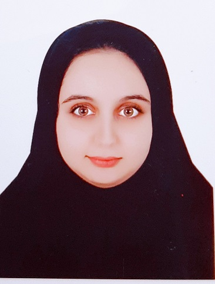

### fatemehghasemi Niyasar

### intro

+ Birthdate 1999,11,9
+ Bachelor
+ Now i am a Bachelors students in computer Engineering
+ Iran,Tehran province 

### Skill Highlights

+ network plus
+ linux 
+ java script
+ word
+ PowerPoint 
+ Excel
+ Photoshop

### Behavioral strengths

+ Communication skill
+ Accountability
+ Adaptability
+ Problem-Solving and decision-making
+ Mentoring 

### Education

+ diploma: froq andishe High School
 -2017
+ Bachelor of science: Computer Engineering 
+  -2018, Payam Noor University of Tehran

### Other Skills

+ Fluent in 2 Languages: English,persian

### Favorites

+ music 
+ swim
+ book riding 

### Working Experience

+ Now i am a Bachelors students in computer Engineering 

### Social Media

+ https://facebook.com/FatemehGhasemi 
+ https://Instagram.com/miss.f7420
+ fatemehghasemi78780@gmail.com 
+ https://quera.ir/profile/fatemehghasemi73780

>Assessment

[Resume and cover letter](https://github.com/fatemehghasemiii/PNU_3991_AR/blob/main/XX_CV_CheckList_AR_3991.pdf)
[Public Sector Evaluation Summary](https://github.com/fatemehghasemiii/PNU_3991_AR/blob/main/XX_CV_CheckList_AR_3991.pdf)

[رزومه فارسی](/resume-fa)
 
